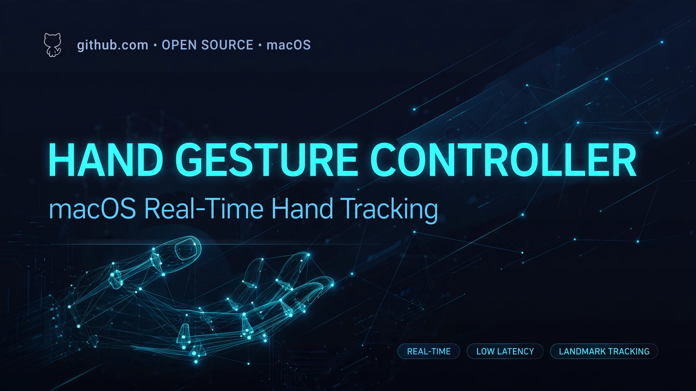

# Hand Gesture Controller

> ## Status: 🟡 In Progress
>
> <progress value="25" max="100"></progress>
>
> **Progress: 25%** — SwiftUI macOS app scaffold with camera preview wiring (4 Swift files, 221 lines). No hand detection, gesture classification, or system control yet.

<p align="center">
  
</p>


## What it is

Hand Gesture Controller is a macOS app that aims to recognize hand gestures in real time from the webcam and display them on screen. The stated V1 objective is recognition + display only — it explicitly does *not* control system functions (mouse, keyboard, apps, volume, scrolling). Right now it's an app scaffold: the SwiftUI window, camera preview view, and an AVFoundation camera manager exist, but no hand-tracking or gesture-recognition code has been written yet.

## What works (verified)

- ✅ **App scaffold builds structurally** — `Package.swift` declares the `HandGestureApp` executable target with the four Swift sources listed (`App/`, `UI/`, `Camera/`); paths and target names line up.
- ✅ **Camera preview UI** — `ContentView.swift` shows a camera-feed panel (or a "CAMERA FEED" placeholder when disconnected) plus gesture-name and confidence labels wired to state.
- ✅ **AVFoundation camera manager skeleton** — `CameraManager.swift` (84 lines) sets up the capture session and exposes a preview layer; `CameraPreviewView.swift` bridges it into SwiftUI.

*Verified by: reading all 4 Swift source files. Not compiled — Swift/Xcode isn't available in this environment, and no CI runs exist.*

## Tech stack

| Layer | Technology |
|---|---|
| Language | Swift 5.9 |
| UI | SwiftUI (macOS 15+) |
| Camera | AVFoundation (`AVCaptureSession`) |
| Build | Swift Package Manager (`Package.swift`) |
| Planned | MediaPipe / CoreML for hand detection (not implemented) |

## How to run

```bash
# Requires: macOS 15+, Xcode 16+, a webcam

# Build and run with SwiftPM
cd HandGestureController
swift build
swift run

# Or open in Xcode
open Package.swift
```

> Note: the old README referenced an `.xcodeproj` at `~/PROJECTS/...` — the repo now builds via `Package.swift`, so the commands above are the correct ones.

## Screenshots

No screenshots yet — the app is a scaffold. The banner above is the only visual.

## What you can add more

- [ ] **Integrate the webcam feed** — wire `CameraManager` to actually start the capture session on launch (the repo's own stated next step)
- [ ] **Hand detection** — add MediaPipe hand-landmark detection or a CoreML hand model to the `HandTracking/` folder (the folder doesn't exist yet)
- [ ] **Gesture classification** — build the `GestureRecognition/` classifier that turns landmarks into named gestures (pinch, swipe, fist…)
- [ ] **Dataset collector + training scripts** — the planned `ML/collection/` and `ML/training/` folders for custom gestures
- [ ] **System control (post-V1)** — mouse/keyboard control was explicitly out of scope for V1; revisit once recognition is solid

## Project structure

```
HandGestureController/
├── Package.swift              # SwiftPM manifest (executable: HandGestureApp)
├── macOS/
│   ├── App/
│   │   └── HandGestureApp.swift      # App entry point (13 lines)
│   ├── UI/
│   │   └── ContentView.swift         # Main window: camera feed + gesture labels
│   ├── Camera/
│   │   ├── CameraManager.swift       # AVFoundation capture session (84 lines)
│   │   └── CameraPreviewView.swift   # NSViewRepresentable preview bridge
└── banner.webp                # Project banner
```

---
*README written after code audit on 2026-10-08.*
